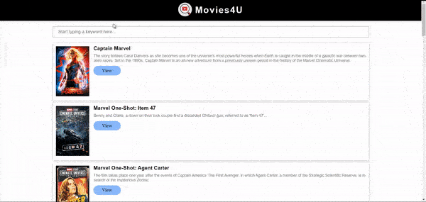

# Web appication is live - [See Preview](https://pratikkarbhal.github.io/Movies4U/).

## *Results:

Compatible with desktop and mobile devices
1) Desktop

2) Mobile

#
#

# *Technologies used

HTML, CSS, JavaScript (JSX ES6), Visual Studio

Libraries - React, jQurey(.ajax method only)

API - The Movie DataBase [TMDB](https://developers.themoviedb.org/3/search/search-movies)

#
#

## Introduction to react

This project was bootstrapped with [Create React App](https://github.com/facebook/create-react-app).

## Available Scripts

In the project directory, you can run:

### `npm start`

### `npm run build`

Builds the app for production to the `build` folder.\
It correctly bundles React in production mode and optimizes the build for the best performance.

The build is minified and the filenames include the hashes.\
Your app is ready to be deployed!

